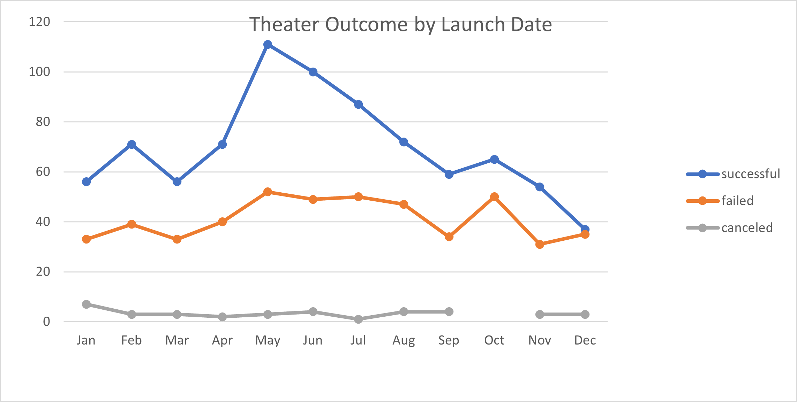
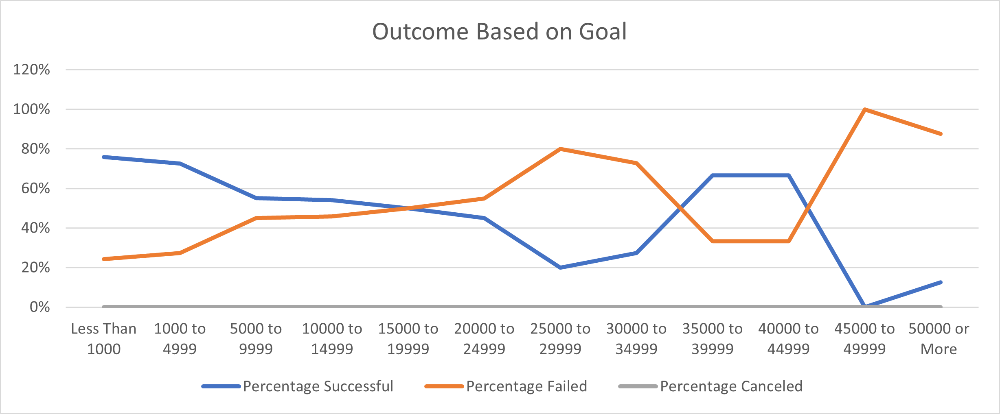

# Kickstarting with Excel

## Overview of Project
Compare compaigns fared baed on Luanch date & funding goals. 
### Purpose
To confirm the relation ship between compaigns outcome based on luanch date and funding goals.
## Analysis and Challenges
This is very usefull data table as well as visual so large data can be shown in a table/chart.
    - we placed lots of data to see trend or normality/ abnormality of data. use of countifs is very interesting.
### Analysis of Outcomes Based on Launch Date
1.  by looking the outcomes with considering launch date, we have observed the variation in all months. however observed consistancy of alwasy more success than failure.
2.  Higher success rate is observed for Month from May to July.
  
### Analysis of Outcomes Based on Goals
1.  High variation is observed with changing the goal.
2.  No dedicated trend is observed in chart. 

### Challenges and Difficulties Encountered
USe of Counterifs funcition was a challenges.
    - Tried different sequences and outcome to get required results.
## Results
- What are two conclusions you can draw about the Outcomes based on Launch Date?
1.  Louise get high successful in theater then failure.
2.  Higher success rate is observed for month from May to July.

- What can you conclude about the Outcomes based on Goals?
1.  More successful is observed with goal up to 9999.
2.  with high goal, higher failure rate is observed.
- What are some limitations of this dataset?
1.  We do observed some outlier data for Theater Outcome by Luanch date and difference between Mean and Median is observed which mean data is not normilized.  
- What are some other possible tables and/or graphs that we could create?
1. We should also use standard deviation/variation - box & Whisker analysis method to see the outlier in database.
